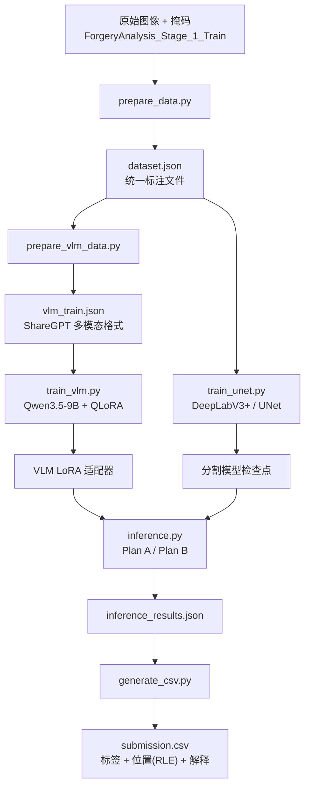

<div align="center">

# DCIC —— 基于多智能体 VLM 的图像伪造分析

[](https://www.python.org/)
[](https://pytorch.org/)
[](https://huggingface.co/docs/transformers)
[](LICENSE)

**视觉语言推理 · 分割定位 · 结构化输出**

[English Version](README.md)

</div>

---

## 📌 这是什么？

本仓库提出了一种**多智能体协作框架**，用于检测并定位图像伪造区域，是为 **DCIC（数据智能计算大赛）图像伪造分析赛道** 开发的参赛方案。

与单模型方案不同，本系统将**视觉语言模型（VLM）的语义推理能力**与**分割模型的像素级定位能力**相结合，同时回答两个核心问题：

1. **这张图片是否伪造？** —— VLM 分析视觉语义，输出二分类判断。
2. **伪造区域在哪里？** —— 分割模型精准定位篡改区域，并编码为 RLE 掩码。

> 🎯 **得分**：65 / 83（该赛道最高分 83）。本方案展示的是一种**实用且可复现的 VLM 训练范式**，而非绝对意义上的最优解。

---

## ✨ 亮点

- 🧠 **多智能体流水线** —— VLM（Qwen3.5-9B）负责推理判断，UNet/DeepLabV3+ 负责像素定位。
- 📝 **结构化输出** —— 强制 VLM 按严格格式输出：`[Detection]`、`[Bboxes]`、`[Explanation]`。
- 🔄 **双方案推理** —— **Plan A**（VLM + SAM2）与 **Plan B**（VLM + 自训练分割模型）。
- 🎓 **QLoRA 微调** —— 9B 模型的 4-bit 量化 LoRA 微调，单张消费级显卡（24 GB）即可训练。
- 🔧 **鲁棒回退解析器** —— 若 VLM 未按格式输出，基于关键词的启发式规则可从自由文本中推断标签。
- 📦 **端到端自动化** —— 六个脚本完成从原始数据 → 训练模型 → 生成提交 CSV 的全流程。

---

## 🏗️ 架构



### 多智能体协作

| 智能体 | 职责 | 模型 | 输出 |
|--------|------|------|------|
| **VLM 智能体** | 语义推理与判断 | Qwen3.5-9B + LoRA (rank=64) | `label` (0/1)、`explanation`、粗略 `bboxes` |
| **分割智能体** | 像素级篡改定位 | DeepLabV3+ (ResNet50) / UNet | 二值掩码 → RLE 编码 |
| **解析智能体** | 结构化输出提取与回退 | 正则 + 关键词启发式 | 标准化的 label、bboxes、explanation JSON |

> VLM 与分割模型作为**互补智能体**协同工作：VLM "理解"哪里有问题，分割模型"精确指出"问题在哪里。

---

## 🚀 快速开始

### 环境要求

- Python >= 3.10
- CUDA >= 11.8（推荐显存 >= 24 GB，可同时训练两个模型）
- Linux / Windows

### 安装依赖

```bash
git clone <仓库地址>
cd DCIC

pip install -r requirements.txt
# 额外依赖：pip install bitsandbytes pycocotools
```

### 准备数据

> ⚠️ **数据说明**：上传到 GitHub 的仓库**不包含完整数据集与模型检查点**，受限于文件体积。
> - `ForgeryAnalysis_Stage_1_Train/` 和 `ForgeryAnalysis_Stage_1_Test/` 仅为空占位目录。
> - 完整数据存放于本地 `ForgeryAnalysis_Stage_1_Train1/`（体积过大，无法上传）。
> - 训练好的检查点（`checkpoints/`）也未包含在内。
>
> 如需获取数据或检查点，**请私信联系**。

### 完整流程

```bash
# 步骤 1：原始数据转换为统一 dataset.json
python scripts/prepare_data.py

# 步骤 2：构建 VLM 训练数据（ShareGPT 格式，含 bbox 缩放）
python scripts/prepare_vlm_data.py --light-compress

# 步骤 3：训练分割模型（Plan B）
python scripts/train_unet.py --architecture deeplabv3plus --encoder resnet50 --epochs 30

# 步骤 4：QLoRA 微调 VLM
python scripts/train_vlm.py

# 步骤 5：推理（默认 Plan B）
python scripts/inference.py \
    --vlm_model models/qwen3.5-9b \
    --lora_path checkpoints/qwen3.5-9b-lora/checkpoint-300 \
    --plan B \
    --unet_ckpt checkpoints/unet_best.pt

# 步骤 6：生成提交 CSV
python scripts/generate_csv.py
```

---

## 🧠 VLM 训练范式

本项目展示了一套**可复现的多模态 VLM 微调范式**，核心设计如下：

1. **结构化提示工程** —— 严格的输出模板强制模型产生机器可读的结果：
   ```
   [Detection] 0 或 1
   [Bboxes] [[x1, y1, x2, y2], ...]
   [Explanation] 详细的推理说明...
   ```

2. **ShareGPT 多模态格式** —— 训练数据采用对话式 `<image><user><assistant>` 结构，兼容 LLaMA-Factory 与现代 VLM 训练器。

3. **4-bit QLoRA** —— 全量微调 9B VLM 成本过高。本项目使用 4-bit 量化 + LoRA（rank=64, alpha=128），单张 RTX 4090 即可完成训练。

4. **智能图像压缩** —— bbox 坐标根据处理器的 resize 行为动态缩放，确保训练与推理的空间对齐。

5. **双重回退策略** —— 即便 VLM 未遵循格式指令，正则 + 关键词启发式层也能从自由文本中恢复标签。

---

## 📊 成绩与反思

| 指标 | 数值 |
|------|------|
| **比赛得分** | **65 / 100** |
| **榜单最高分** | 83 / 100 |
| **VLM 骨干** | Qwen3.5-9B |
| **微调方式** | QLoRA（4-bit，rank=64） |
| **分割模型** | DeepLabV3+ / UNet + ResNet50 |
| **训练耗时** | RTX 4090 上约 3 小时（VLM）+ 2 小时（UNet） |

### 为什么不是更高？

65 分反映的是**轻量级、资源受限设置下的性能上限**，而非方法本身的天花板。要冲击 83 分的顶尖成绩，需要：

- **更大的模型** —— 使用 Qwen-72B 或 InternVL2-40B 替代 9B，获得更强的视觉推理能力。
- **更好的数据处理** —— 更精细的数据增强、困难负样本挖掘、伪标签策略。
- **更强的分割网络** —— 微调 SAM2 或任务专用的伪造检测分割网络，替代通用 UNet。
- **集成与多尺度测试** —— 多模型投票、多分辨率输入融合。
- **迭代式精炼** —— 利用 VLM 的解释反向引导，生成更高质量的训练标注。

> 💡 **本仓库是一个起点，而非终点。** 它证明即使只用 9B 模型 + 简单 LoRA，也能打出可接受的基线。代码设计为**可扩展**的 —— 你可以更换更大的模型、重新设计 prompt、或替换分割头。

---

## 📁 仓库结构

```
DCIC/
├── scripts/
│   ├── prepare_data.py          # 步骤 1：原始数据 → dataset.json
│   ├── prepare_vlm_data.py      # 步骤 2：dataset.json → vlm_train.json（ShareGPT）
│   ├── train_unet.py            # 步骤 3：训练分割模型
│   ├── train_vlm.py             # 步骤 4：QLoRA 微调 Qwen3.5-9B
│   ├── inference.py             # 步骤 5：多智能体推理（Plan A/B）
│   ├── generate_csv.py          # 步骤 6：生成提交 CSV
│   ├── plot_train_log.py        # 训练可视化辅助
│   ├── rerun_bad_inference.py   # 重跑失败样本
│   └── regenerate_csv_from_edited.py  # 编辑后重新生成 CSV
│
├── src/
│   ├── utils.py                 # RLE 编解码、VLM 输出解析、bbox 提取
│   ├── unet_model.py            # UNet / DeepLabV3+ 定义
│   └── unet_dataset.py          # 分割数据集加载器
│
├── configs/
│   └── qwen3.5_9b_lora.yaml     # LLaMA-Factory QLoRA 配置
│
├── data/
│   ├── dataset_info.json        # 数据集元数据
│   └── (运行时生成 inference_results.json / submission.csv)
│
├── checkpoints/                 # ⚠️ 未上传（体积过大）
│   ├── unet_best.pt
│   └── qwen3.5-9b-lora/
│
├── models/                      # 基座模型占位目录
│   └── qwen3.5-9b/
│
├── ForgeryAnalysis_Stage_1_Train/   # ⚠️ 空占位（数据仅本地可用）
├── ForgeryAnalysis_Stage_1_Test/    # ⚠️ 空占位
├── test_label_infer.py          # 标签解析器快速测试
├── train_log.txt / .png         # 训练日志
├── WORKFLOW.md                  # 详细中文流程文档
└── README.md / README-CN.md     # 本文件
```

---

## 🤝 如何改进

本代码库采用模块化设计，方便你单独升级各个组件：

1. **更优的标注** —— 利用 `prepare_vlm_data.py` 的逻辑生成更丰富的 prompt（如思维链推理、多轮对话）。
2. **更强的 VLM** —— 在 `train_vlm.py` 中将 `Qwen3.5-9B` 替换为 `Qwen2-VL-72B` 或 `InternVL2-40B`。
3. **更强的分割** —— 将 UNet 替换为伪造任务专用网络，或针对该任务微调 SAM2。
4. **多模型集成** —— 运行多个 VLM 变体，对最终标签进行投票。
5. **Prompt 优化** —— `inference.py` 中的 `USER_PROMPT` 是全局统一 prompt。按图像类别分别优化 prompt 可能带来显著提升。

---

## 📄 许可证

MIT 许可证。

---

<div align="center">

**⭐ 如果这套范式对你的研究或比赛有所帮助，欢迎点一颗 Star！⭐**

**📧 需要完整数据集或检查点？欢迎私信联系。**

</div>
