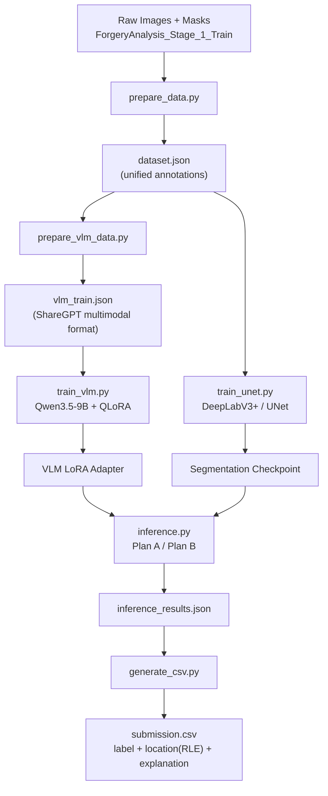

<div align="center">

# DCIC — Image Forgery Analysis via Multi-Agent VLM

[](https://www.python.org/)
[](https://pytorch.org/)
[](https://huggingface.co/docs/transformers)
[](LICENSE)

**VLM Reasoning · Segmentation Localization · Structured Output**

[中文介绍](README-CN.md)

</div>

---

## 📌 What Is This?

This repository presents a **multi-agent collaborative framework** for detecting and localizing image forgeries, developed for the **DCIC (Data Centric Intelligent Computing) Image Forgery Analysis competition**.

Unlike single-model approaches, this system combines the **semantic reasoning power of a Vision-Language Model (VLM)** with the **pixel-precise localization capability of a segmentation model** to answer two critical questions:

1. **Is this image forged?** — The VLM analyzes visual semantics and outputs a binary judgment.
2. **Where is it forged?** — The segmentation model pinpoints tampered regions and encodes them as RLE masks.

> 🎯 **Score**: 65 / 83 (Top-tier score on the leaderboard was 83). This solution demonstrates a **practical and reproducible VLM training paradigm**, not the absolute state-of-the-art.

---

## ✨ Highlights

- 🧠 **Multi-Agent Pipeline** — VLM (Qwen3.5-9B) for reasoning + UNet/DeepLabV3+ for localization.
- 📝 **Structured Output** — Forces the VLM to respond in a strict format: `[Detection]`, `[Bboxes]`, `[Explanation]`.
- 🔄 **Dual Inference Plans** — **Plan A** (VLM + SAM2) and **Plan B** (VLM + trained segmentation model).
- 🎓 **QLoRA Fine-Tuning** — 4-bit quantized LoRA on a 9B model, trainable on a single consumer GPU (24 GB).
- 🔧 **Robust Fallback Parser** — If the VLM ignores the format, keyword-based heuristics infer the label from free-text explanations.
- 📦 **End-to-End Automation** — Six scripts take you from raw data → trained models → competition submission CSV.

---

## 🏗️ Architecture



### Multi-Agent Collaboration

| Agent | Role | Model | Output |
|-------|------|-------|--------|
| **VLM Agent** | Semantic reasoning & judgment | Qwen3.5-9B + LoRA (rank=64) | `label` (0/1), `explanation`, rough `bboxes` |
| **Segmentation Agent** | Pixel-level tamper localization | DeepLabV3+ (ResNet50) / UNet | Binary mask → RLE encoding |
| **Parser Agent** | Structured output extraction + fallback | Regex + keyword heuristics | Normalized JSON with label, bboxes, explanation |

> The VLM and segmentation model operate as **complementary agents**: the VLM "understands" what is wrong, while the segmentation model "shows exactly where" it is wrong.

---

## 🚀 Quick Start

### Prerequisites

- Python >= 3.10
- CUDA >= 11.8 (24 GB VRAM recommended for training both models)
- Linux / Windows

### Installation

```bash
git clone <repo-url>
cd DCIC

pip install -r requirements.txt
# Additional: pip install bitsandbytes pycocotools
```

### Prepare Data

> ⚠️ **Note on Data**: The repository uploaded to GitHub does **not** include the full dataset or model checkpoints due to size limits.
> - `ForgeryAnalysis_Stage_1_Train/` and `ForgeryAnalysis_Stage_1_Test/` are empty placeholders.
> - Full data exists locally in `ForgeryAnalysis_Stage_1_Train1/` (too large for GitHub).
> - Trained checkpoints (`checkpoints/`) are also excluded.
>
> If you need the data or checkpoints, please **contact me privately**.

### Full Pipeline

```bash
# Step 1: Convert raw data to unified dataset.json
python scripts/prepare_data.py

# Step 2: Build VLM training data (ShareGPT format with bbox scaling)
python scripts/prepare_vlm_data.py --light-compress

# Step 3: Train segmentation model (Plan B)
python scripts/train_unet.py --architecture deeplabv3plus --encoder resnet50 --epochs 30

# Step 4: Fine-tune VLM with QLoRA
python scripts/train_vlm.py

# Step 5: Run inference (Plan B by default)
python scripts/inference.py \
    --vlm_model models/qwen3.5-9b \
    --lora_path checkpoints/qwen3.5-9b-lora/checkpoint-300 \
    --plan B \
    --unet_ckpt checkpoints/unet_best.pt

# Step 6: Generate submission CSV
python scripts/generate_csv.py
```

---

## 🧠 VLM Training Paradigm

This project showcases a **reproducible paradigm for fine-tuning multimodal VLMs on image forgery detection**:

1. **Structured Prompt Engineering** — A strict output template forces the model to produce machine-readable results:
   ```
   [Detection] 0 or 1
   [Bboxes] [[x1, y1, x2, y2], ...]
   [Explanation] Detailed reasoning...
   ```

2. **ShareGPT Multimodal Format** — Training data follows the conversational `<image><user><assistant>` structure compatible with LLaMA-Factory and modern VLM trainers.

3. **4-bit QLoRA** — Full fine-tuning a 9B VLM is prohibitively expensive. We use 4-bit quantization + LoRA (rank=64, alpha=128), making training feasible on a single RTX 4090.

4. **Smart Image Compression** — Bbox coordinates are dynamically scaled to match the processor's resize behavior, ensuring spatial alignment between training and inference.

5. **Dual Fallback Strategy** — Even if the VLM ignores formatting instructions, a regex + keyword heuristic layer recovers the label from free-text explanations.

---

## 📊 Result & Reflection

| Metric | Value |
|--------|-------|
| **Competition Score** | **65 / 100** |
| **Leaderboard Best** | 83 / 100 |
| **VLM Backbone** | Qwen3.5-9B |
| **Fine-Tuning** | QLoRA (4-bit, rank=64) |
| **Segmentation** | DeepLabV3+ / UNet + ResNet50 |
| **Training Time** | ~3 hours (VLM) + ~2 hours (UNet) on RTX 4090 |

### Why Not Higher?

This score (65) reflects the **limitations of a lightweight, resource-constrained setup**, not the ceiling of the approach itself. To push toward the top score (83), you would need:

- **Larger models** — Qwen-72B or InternVL2-40B instead of 9B for stronger visual reasoning.
- **Better data processing** — More sophisticated augmentation, hard-negative mining, and pseudo-labeling strategies.
- **Stronger segmentation** — SAM2 fine-tuning or a task-specific forgery segmentation network instead of a generic UNet.
- **Ensemble & multi-scale testing** — Voting across multiple models and input resolutions.
- **Iterative refinement** — Using the VLM's explanation to bootstrap better training annotations.

> 💡 **This repo is a starting point, not the final answer.** It demonstrates that even a 9B model with simple LoRA can achieve a respectable baseline. The code is designed to be **extended** — swap in a bigger model, redesign the prompts, or replace the segmentation head.

---

## 📁 Repository Structure

```
DCIC/
├── scripts/
│   ├── prepare_data.py          # Step 1: Raw → dataset.json
│   ├── prepare_vlm_data.py      # Step 2: dataset.json → vlm_train.json (ShareGPT)
│   ├── train_unet.py            # Step 3: Train segmentation model
│   ├── train_vlm.py             # Step 4: QLoRA fine-tune Qwen3.5-9B
│   ├── inference.py             # Step 5: Multi-agent inference (Plan A/B)
│   ├── generate_csv.py          # Step 6: Submission CSV generation
│   ├── plot_train_log.py        # Visualization helper
│   ├── rerun_bad_inference.py   # Re-run failed cases
│   └── regenerate_csv_from_edited.py  # Edit → CSV
│
├── src/
│   ├── utils.py                 # RLE encode/decode, VLM output parser, bbox extraction
│   ├── unet_model.py            # UNet / DeepLabV3+ definition
│   └── unet_dataset.py          # Segmentation dataset loader
│
├── configs/
│   └── qwen3.5_9b_lora.yaml     # LLaMA-Factory QLoRA config
│
├── data/
│   ├── dataset_info.json        # Dataset metadata
│   └── (inference_results.json / submission.csv generated at runtime)
│
├── checkpoints/                 # ⚠️ Not uploaded (too large)
│   ├── unet_best.pt
│   └── qwen3.5-9b-lora/
│
├── models/                      # Placeholder for base model
│   └── qwen3.5-9b/
│
├── ForgeryAnalysis_Stage_1_Train/   # ⚠️ Empty placeholder (data available locally)
├── ForgeryAnalysis_Stage_1_Test/    # ⚠️ Empty placeholder
├── test_label_infer.py          # Quick test for label parser
├── train_log.txt / .png         # Training logs
├── WORKFLOW.md                  # Detailed Chinese workflow guide
└── README.md / README-CN.md     # This file
```

---

## 🤝 How to Improve

This codebase is intentionally modular so you can upgrade individual components:

1. **Better Annotations** — Use the existing `prepare_vlm_data.py` logic to generate richer prompts (e.g., chain-of-thought reasoning, multi-turn dialogues).
2. **Stronger VLM** — Swap `Qwen3.5-9B` for `Qwen2-VL-72B` or `InternVL2-40B` in `train_vlm.py`.
3. **Better Segmentation** — Replace the UNet with a forgery-specific network or fine-tune SAM2 on the task.
4. **Multi-Model Ensemble** — Run multiple VLM variants and vote on the final label.
5. **Prompt Optimization** — The `USER_PROMPT` in `inference.py` is a single global prompt. Optimizing it per image category could yield significant gains.

---

## 💡 A Spontaneous Idea: Contrastive VLM Training

While reflecting on the current supervised fine-tuning (SFT) pipeline, an interesting direction came to mind — **what if we train the VLM with contrastive learning instead of (or in addition to) standard next-token prediction?**

### The Intuition

Current SFT teaches the model to "generate the correct caption," but it does not explicitly shape the **similarity structure** of the vision-language embedding space. In forgery detection, we want:

- **Forged images** to cluster closely with text descriptions like "digitally tampered," "forged receipt," or "spliced composite."
- **Authentic images** to cluster with phrases like "real photograph," "no tampering detected."

A contrastive objective (e.g., inspired by **SigLIP**, **CLIP**, or **CoCa**) could explicitly pull positive `(image, text)` pairs together while pushing negatives apart in the joint embedding space.

### A Tentative Recipe

1. **Construct contrastive pairs** from the training set:
   - *Positive pairs*: `(forged_image, "This image contains digital forgery.")`, `(authentic_image, "This is a real photograph.")`
   - *Hard negatives*: `(forged_image, "This is a real photograph.")`, `(authentic_image, "This image is forged.")`
2. **Add a contrastive head** on top of the VLM's vision and text embeddings.
3. **Combine losses**: `L_total = L_SFT + λ * L_contrastive`, where `L_SFT` is the standard caption generation loss and `L_contrastive` is a sigmoid-based or InfoNCE-based alignment loss.
4. **Evaluate on a held-out validation set** — compare `val_accuracy`, `AUC`, and `recall@k` between pure SFT and SFT + contrastive.

### Why It Might Help

- The current parser relies heavily on **keyword matching** as a fallback. If the embedding space is better structured, the VLM may produce more **consistent and deterministic** outputs even without strict formatting prompts.
- Contrastive pre-training has shown strong results in vision-language retrieval; extending it to fine-grained forgery discrimination is a natural next step.

> ⚠️ **Disclaimer**: This is an **untested hypothesis** at the time of writing. The dataset would need to be re-split into contrastive triplets, and the training script would require a custom dataloader and loss function. If you are interested, feel free to fork the repo, implement a SigLIP-style contrastive objective on top of `train_vlm.py`, and share your findings — especially whether basic classification accuracy improves over vanilla LoRA fine-tuning.

---

## 📄 License

MIT License.

---

<div align="center">

**⭐ If this paradigm helps your research or competition, please give it a star! ⭐**

**📧 Need the full dataset or checkpoints? Feel free to reach out privately.**

</div>
